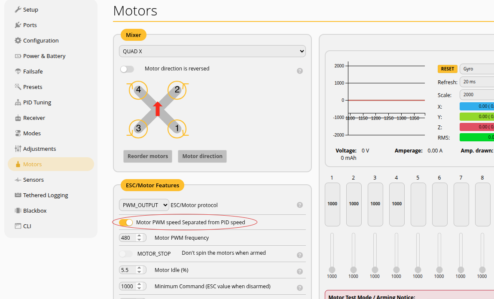

export GZ_SIM_SYSTEM_PLUGIN_PATH=/home/user/workspaces/beta_ws/src/aeroloop_gazebo/plugins/build:$GZ_SIM_SYSTEM_PLUGIN_PATH
export GZ_SIM_RESOURCE_PATH=/home/user/workspaces/beta_ws/src/aeroloop_gazebo/worlds:/home/user/workspaces/beta_ws/src/aeroloop_gazebo/models:$GZ_SIM_RESOURCE_PATH
gz sim -r -v 4 betaloop_iris_betaflight_demo_harmonic.sdf


```bash title="uart(web socket) tcp proxy"
# Run the proxy (UART1 is at TCP port 5761)
websockify 127.0.0.1:6761 127.0.0.1:5761
```

```
/home/user/projects/betaflight/obj/main/betaflight_SITL.elf
```

```
https://app.betaflight.com/
```

